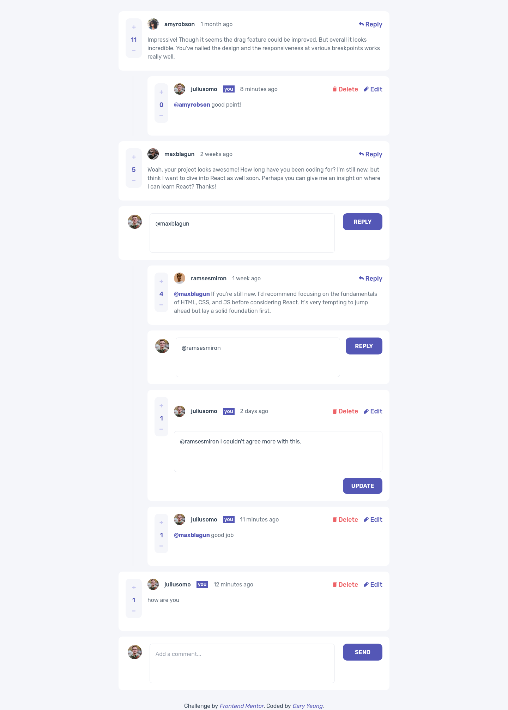
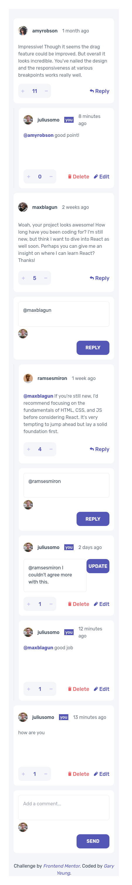
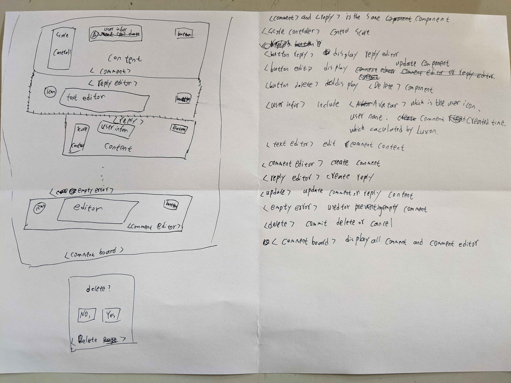

# Frontend Mentor - Interactive comments section solution

This is a solution to the [Interactive comments section challenge on Frontend Mentor](https://www.frontendmentor.io/challenges/interactive-comments-section-iG1RugEG9). Frontend Mentor challenges help you improve your coding skills by building realistic projects. 

## Table of contents

- [Overview](#overview)
  - [The challenge](#the-challenge)
  - [Screenshot](#screenshot)
  - [Links](#links)
- [My process](#my-process)
  - [Built with](#built-with)
  - [What I learned](#what-i-learned)
  - [Continued development](#continued-development)
  - [Useful resources](#useful-resources)
- [Author](#author)
- [Acknowledgments](#acknowledgments)

## Overview

### The challenge

Users should be able to:

- View the optimal layout for the app depending on their device's screen size
- See hover states for all interactive elements on the page
- Create, Read, Update, and Delete comments and replies
- Upvote and downvote comments
- **Bonus**: If you're building a purely front-end project, use `localStorage` to save the current state in the browser that persists when the browser is refreshed.
- **Bonus**: Instead of using the `createdAt` strings from the `data.json` file, try using timestamps and dynamically track the time since the comment or reply was posted.

### Screenshot

### Links
- Solution URL: [Interactive Comments Solution](https://github.com/garyeung/Frontend-Mentor-Challenges/tree/master/interactive-comments-section-main)
- Live Site URL: [Interactive Comments Live](https://garyeung.github.io/Frontend-Mentor-Challenges/imteractive-comments-section-main)

## My process

### Built with

- [React](https://reactjs.org/) - JS library
- [Vite](https://vitejs.dev/)  - For development and building 
- [TailwindCSS](https://tailwindcss.com/) - CSS Framework
- [Zustand](https://github.com/pmndrs/zustand) - state management
- [Luxon](https://moment.github.io/luxon/#/) - JS library for dealing with dates

### What I learned
learned how to use state management for prevent props drilling and which can manage state better and flexible   
learned how to abstract similar components into one.  

### Continued development
To build a full-stack application  

### Useful resources

## Author

## Acknowledgments